# Операционные системы UNIX/Linux (Базовый)

## Part 1. Установка ОС

| 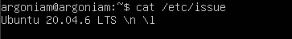 |
| :------------------------------------------------------------------: |
|                         _Рис. 1. Версия ОС_                          |

## Part 2. Создание пользователя

| 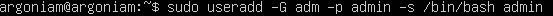 |
| :----------------------------------------------------------------------------------------: |
|                              _Рис. 2. Создание пользователя_                               |

| 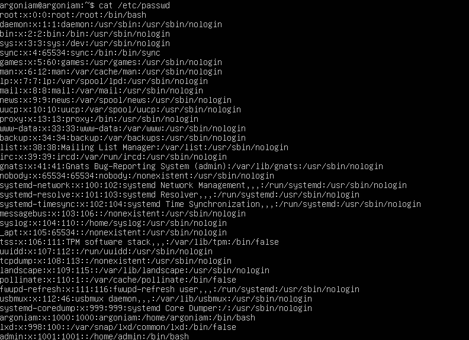 |
| :----------------------------------------------------------------------------------------: |
|                               _Рис. 3. Список пользователей_                               |

## Part 3. Настройка сети ОС

|  |
| :---------------------------------------------------------------------------------------------: |
|                                _Рис. 4. Задание названия машине_                                |

---

Нужно узнать полное название часового пояса. Обычно в соглашении об именовании используется формат «Регион/Город». Можно объединить команду `timedatectl` с командой grep для фильтрации поиска по названию города:

| 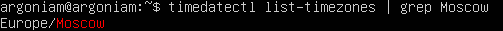 |
| :-------------------------------------------------------------------------------------------------------: |
|                                      _Рис. 5. Названия часовой зоны_                                      |

| 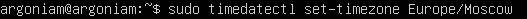 |
| :-------------------------------------------------------------------------------------------------------: |
|                                    _Рис. 6. Установка временной зоны_                                     |

| 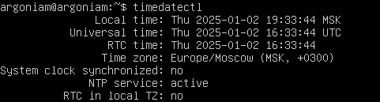 |
| :------------------------------------------------------------------------------------------------: |
|                                 _Рис. 7. Проверка временной зоны_                                  |

---

| 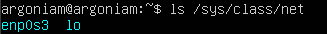 |
| :-------------------------------------------------------------------------------------------------------------------------: |
|                                            _Рис. 8. Список сетевых интерфейсов_                                             |

`lo` является устройством обратной связи. Вы можете представить его как виртуальное сетевое устройство, которое есть во всех системах, даже если они не подключены ни к одной сети. Он имеет IP-адрес и может использоваться для локального доступа к сетевым службам. Например, если вы запускаете веб-сервер на своем компьютере и переходите к нему с помощью Firefox или Chromium на той же машине, то он будет проходить через это сетевое устройство. Обычно интерфейс `lo` имеет зарезервированный IP-адрес `127.0.0.1`, известный как "localhost".

---

| 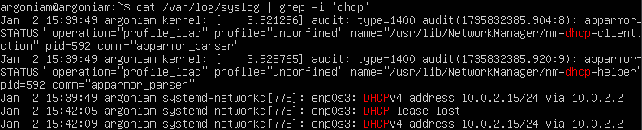 |
| :------------------------------------------------------------------------------------------------------------------------------------: |
|                                             _Рис. 9. ip адрес устройства от DHCP-сервера_                                              |

DHCP (Dynamic Host Configuration Protocol) — сетевой протокол, который позволяет автоматически назначать IP-адреса и другие параметры конфигурации устройствам в сети.

---

|  |
| :------------------------------------------------------------------------------------------------------------------------: |
|                                         _Рис. 10. Внутреннего ip адрес устройства_                                         |

| 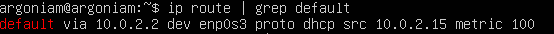 |
| :------------------------------------------------------------------------------------------------------------------: |
|                                       _Рис. 11. Внешнего ip адрес устройства_                                        |

---

|  |
| :--------------------------------------------------------------------------------------------------------------: |
|                                  _Рис. 12. Команда входа в редактор ip адресов_                                  |

Зададим статические настройки: изменим параметр "dhcp4" на значение `false`, в "addresses" укажем статический IP-адрес: `192.168.1.45/24`, и в "gateway4" зададим внутренний IP-адрес `192.168.1.1`. В параметре "addresses" раздела "nameservers" укажем публичные серверы.

| 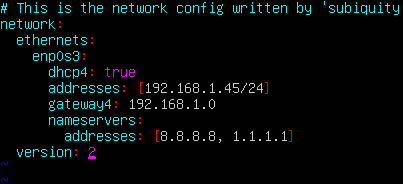 |
| :-------------------------------------------------------------------------------------: |
|                             _Рис. 13. Написанный yaml файл_                             |

Применение изменений: `sudo netplan apply`

Нужно перезапустить систему: `reboot`

| 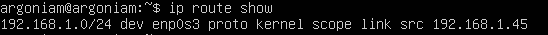 |
| :------------------------------------------------------------------------------------------------------------------------------------------: |
|                                            _Рис. 14. Вывод измененных внешнего и внутреннего ip_                                             |

---

Пропингуем 1.1.1.1 и ya.ru:
`ping 1.1.1.1 -c 3`
`ping ya.ru -c 3`

| 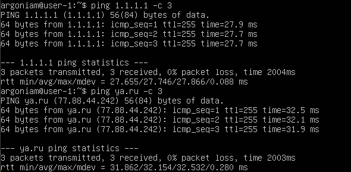 |
| :------------------------------------------------------------------: |
|                      _Рис. 15. Результат пинга_                      |

Результат `0% packet loss` - это свидетельствует о том, что компьютер получил ответ от всех отправленных на указанные сервера пакетов данных.

## Part 4. Обновление ОС

Обновление списка пакетов: `sudo apt update`

Обновление системных пакетов до последней версии: `sudo apt full-upgrade`

| 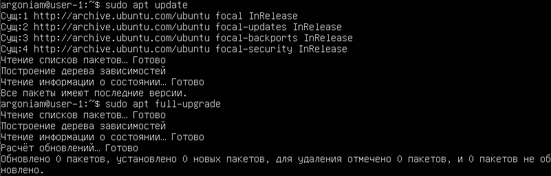 |
| :--------------------------------------------------------------------------------------------------------------------------------: |
|                                       _Рис. 16. Результат повторного использования команды_                                        |

## Part 5. Использование команды sudo

sudo (сокращение от "superuser do") — это команда в операционных системах Unix-подобного типа, которая позволяет пользователю выполнять команды с правами администратора (суперпользователя). Это нужно для выполнения операций, которые требуют повышенных привилегий, например, установки программ или изменения системных настроек.

Необходимо пользователя добавить в группу sudo для доступа к выполнению команды "sudo": `sudo usermod -a -G sudo admin`

Проверим что пользователь в группе: `groups admin`

| 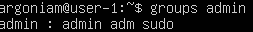 |
| :------------------------------------------------------------------------------------------------------------: |
|                                      _Рис. 17. Вывод групп пользователя_                                       |

---

| 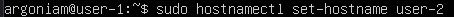 |
| :--------------------------------------------------------------------------------------------------------: |
|                                  _Рис. 18. Команда для смены имени хоста_                                  |

Чтобы проверить что всё правильно поменялось: `reboot`, `hostname`

| 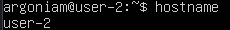 |
| :----------------------------------------------------------------------------------------: |
|                                _Рис. 19. Вывод имени хоста_                                |

## Part 6. Установка и настройка службы времени

Чтобы вывести время часового пояса нужно использовать команду: `date`

| 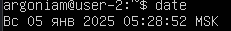 |
| :--------------------------------------------------------------------: |
|                         _Рис. 20. Вывод даты_                          |

---

Для вывода настроек часового пояса используем команду: `timedatectl show`

|  |
| :----------------------------------------------------------------------------------------------------------------------: |
|                                         _Рис. 21. Вывод настроек часового пояса_                                         |

## Part 7. Установка и использование текстовых редакторов

Чтобы выполнить уставку текстовых редакторов нужно выполнить команду: `sudo apt install X`, где X - это нужный нам текстовый редактор.

---

VIM. Для выхода с сохранением изменений нужно нажать `ESC`, далее написать `:wq`(write and quit).

|  |
| :-------------------------------------: |
|             _Рис. 22. VIM_              |

NANO. Для выхода с сохранением изменений нужно нажать `Ctrl + O` (Write out) и `Ctr + X` (Exit).

| 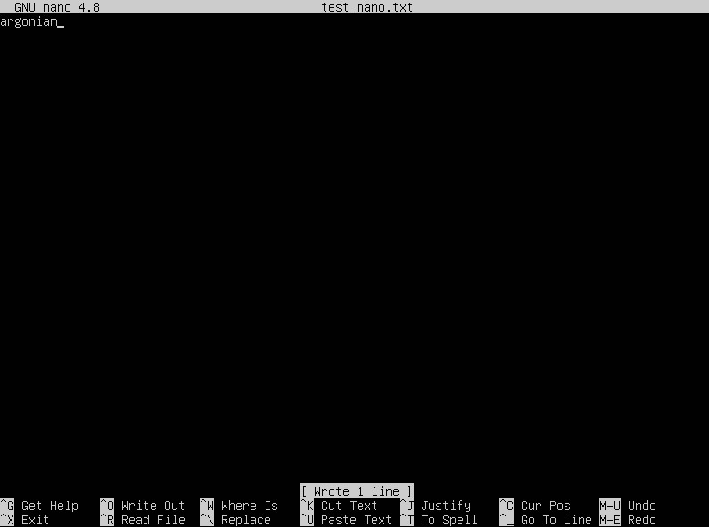 |
| :----------------------------------------: |
|              _Рис. 23. NANO_               |

JOE. Для выхода с сохранением изменений нужно нажать `Ctrl + K`, а потом `X` (Save and Exit).

| 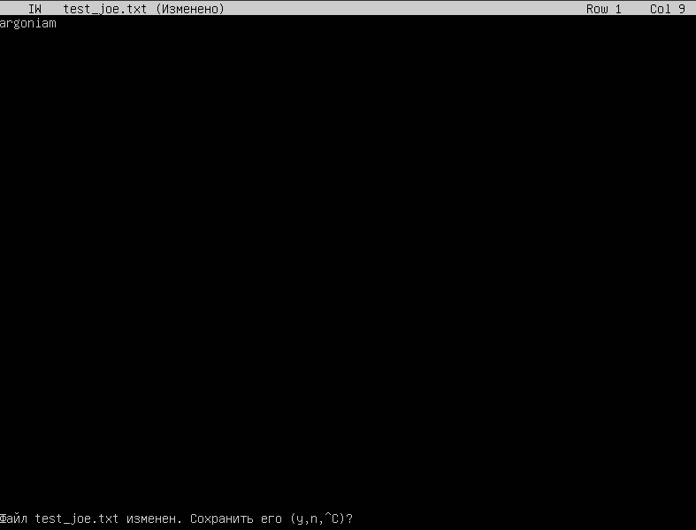 |
| :-------------------------------------: |
|             _Рис. 24. JOE_              |

---

VIM. Для выхода без сохранения нужно нажать `ESC`, далее написать `:q!`(quit).

|  |
| :--------------------------------------: |
|              _Рис. 25. VIM_              |

| 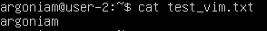 |
| :------------------------------------------------------------------------------------------: |
|                                    _Рис. 26. Вывод файла_                                    |

NANO. Для выхода без сохранения изменений нужно нажать `Ctr + X` (Exit) и подтвердить выход, нажать `N`.

| 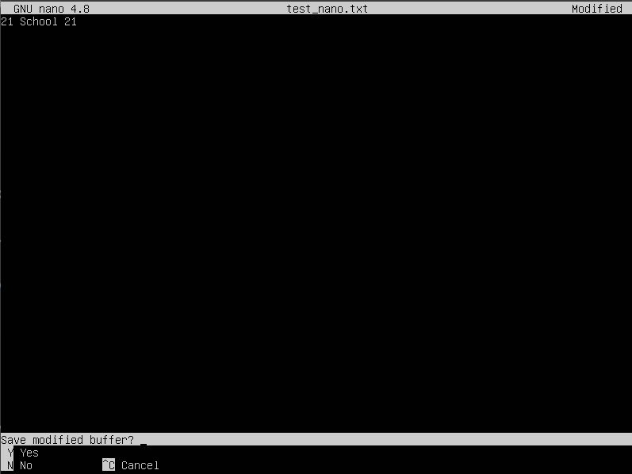 |
| :-----------------------------------------: |
|               _Рис. 27. NANO_               |

| 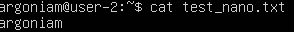 |
| :--------------------------------------------------------------------------------------------: |
|                                     _Рис. 28. Вывод файла_                                     |

JOE. Для выхода без сохранения изменений нужно нажать `Ctrl + C`, а потом `y`.

| 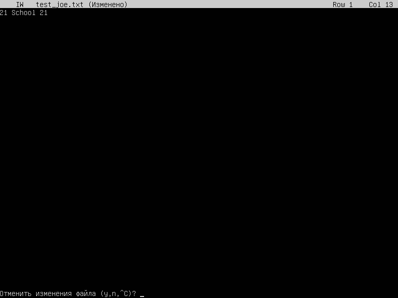 |
| :--------------------------------------: |
|              _Рис. 29. JOE_              |

| 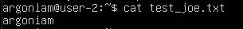 |
| :------------------------------------------------------------------------------------------: |
|                                    _Рис. 30. Вывод файла_                                    |

---

VIM. Для поиска нужного нам слова нужно напечатать `/` и ввести поиск шаблона.

| 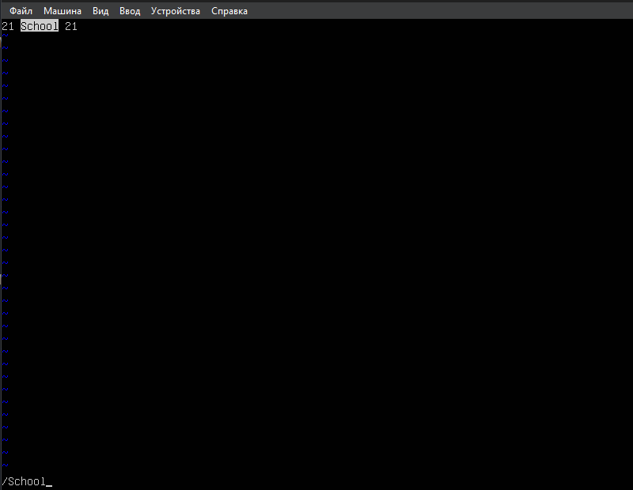 |
| :--------------------------------------------: |
|             _Рис. 31. Поиск в VIM_             |

Для замены слова в vim нужно `:s/{pattern}/{string}`, где pattern - это слово которое мы будем заменять и string - слово на которое мы будем заменять.

| 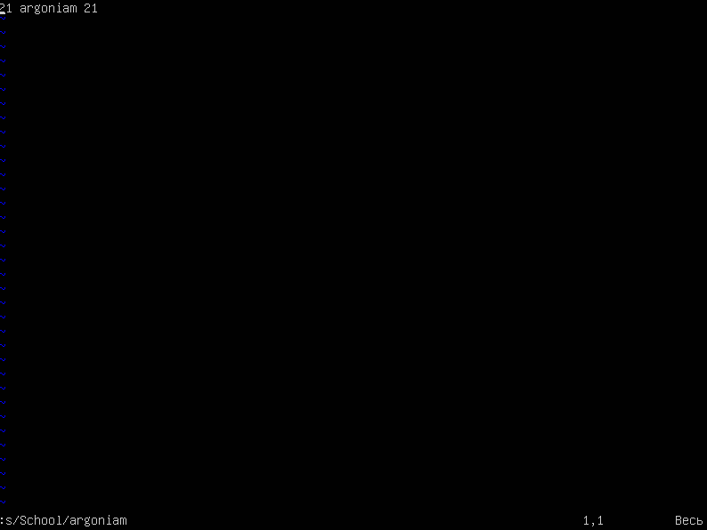 |
| :---------------------------------------------: |
|             _Рис. 32. Замена в VIM_             |

NANO. Для поиска нужного нам слова нужно нажать `Ctrl + W`, а далее написать нужный нам паттерн.

| 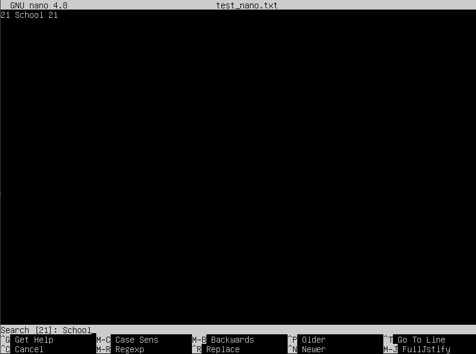 |
| :-----------------------------------------------: |
|              _Рис. 33. Поиск в NANO_              |

Для замены слова в nano нужно нажать `Alt + R` и сначала написать паттерн, далее слово на которое булем заменять.

| 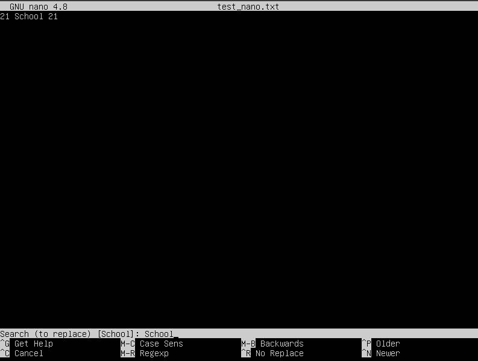 |
| :-------------------------------------------------: |
|              _Рис. 34. Замена в NANO_               |

|  |
| :-------------------------------------------------: |
|              _Рис. 35. Замена в NANO_               |

| 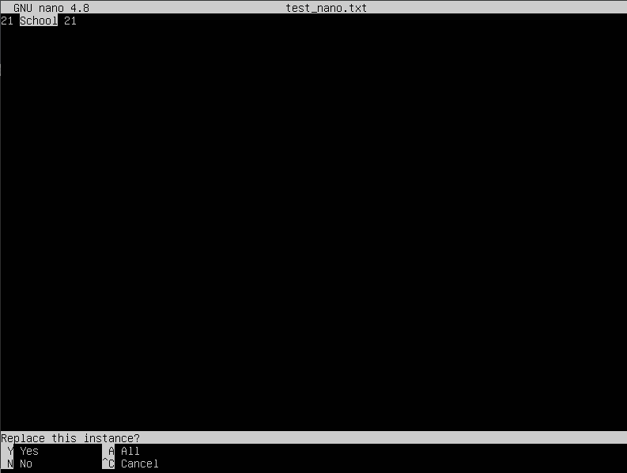 |
| :-------------------------------------------------: |
|              _Рис. 36. Замена в NANO_               |

| 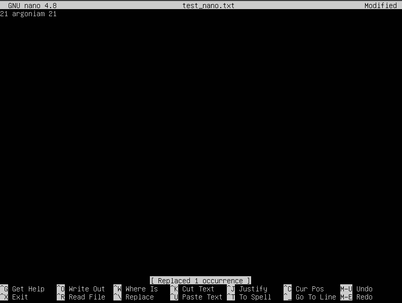 |
| :-------------------------------------------------: |
|              _Рис. 37. Замена в NANO_               |

JOE. Для поиска в joe нужно нажать `Ctrl + K`, далее `F` и написать нужный нам паттерн.

| 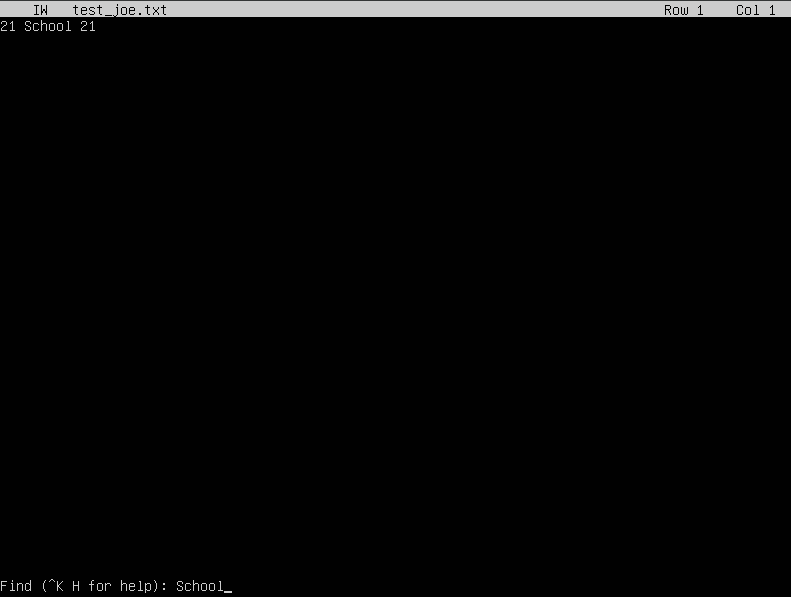 |
| :--------------------------------------------: |
|             _Рис. 38. Поиск в JOE_             |

Для замены слова в joe нужно всё тоже самое что и для поиска, но в конце нажать `R` и написать слово на которое мы будем заменять.

| 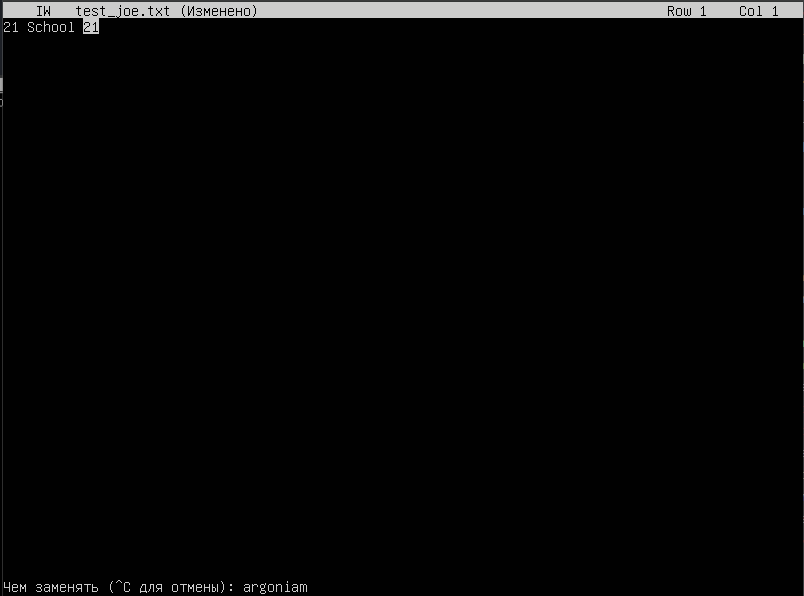 |
| :----------------------------------------------: |
|             _Рис. 39. Замена в JOE_              |

| 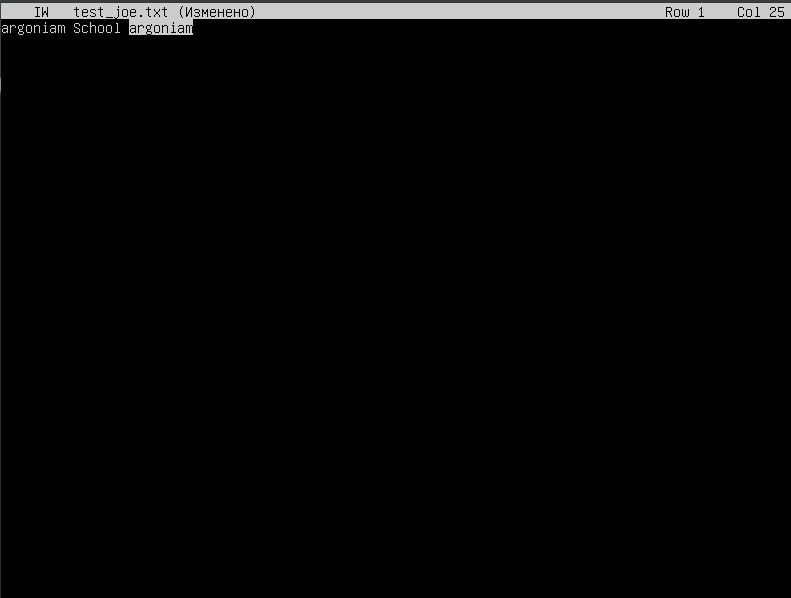 |
| :----------------------------------------------: |
|             _Рис. 40. Замена в JOE_              |

## Part 8. Установка и базовая настройка сервиса SSHD

Установить службу SSHd можно с помощью команды: `sudo apt install openssh-server`.

---

С помощью команды `sudo systemctl enable ssh` установим автостарт службы при загрузки системы.

| 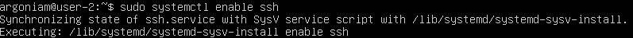 |
| :-------------------------------------------------------------------------: |
|                          _Рис. 41. Автостарт ssh_                           |

---

Чтобы изменить порт службы SSHd используем команду: `sudo nano /etc/ssh/sshd_config`

Раскомментируем параметр `Port` и изменим его значение с 22 на 2022

| 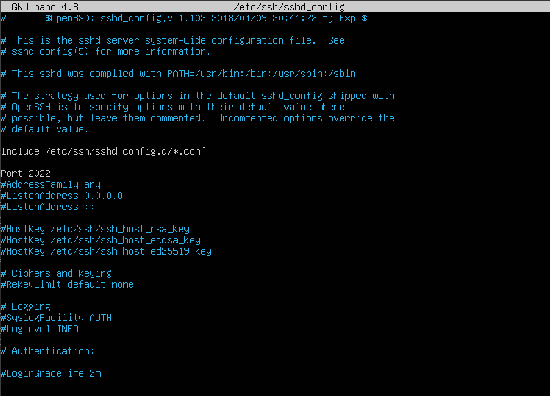 |
| :----------------------------------------------------------------------: |
|                   _Рис. 42. Изменение параметра Port_                    |

Чтобы изменения в конфигурации сохранились нужно перезапустить ssh сервер: `sudo systemctl restart ssh`

Теперь используем команду `sudo systemctl status ssh`, где мы увидим наши изменения (автозапуск и порт).

| 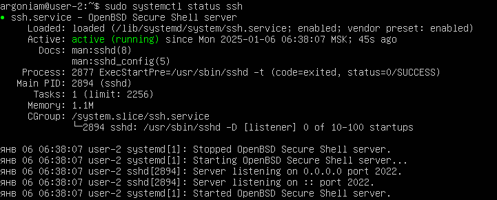 |
| :---------------------------------------------------------------------: |
|                      _Рис. 43. Статус ssh сервера_                      |

---

Чтобы показать наличие процесса sshd, используем команду: `ps aux | grep -i ssh`.

|  |
| :----------------------------------------------------------------: |
|                      _Рис. 44. Процессы SSHd_                      |

`ps` — это мощный инструмент, позволяющий мониторить состояние процессов в Linux, а возможность комбинировать `ps` с другими командами, работающими с выводом данных в терминал, делает такую связку почти универсальной для точечного мониторинга.

- Параметр `-a` передаёт `ps` задание исключить лидеров сеансов и процессы, не связанные с терминалом.
- Параметр `-u` в команде `ps` в Linux позволяет отобразить дополнительную информацию о процессах.
- Параметр `-x` в команде `ps` в Linux перечисляет процессы без управляющего терминала.

`grep -i ssh` - выводит только те строчки, где есть `ssh` с игнорированием регистра за счет `-i`.

---

Выполним перезагрузку системы с помощью команды `reboot`.

Вывод команды `netstat -tan`:

| 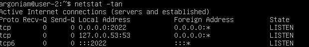 |
| :-------------------------------------------------------------: |
|                _Рис. 45. Вывод команды netstat_                 |

- Параметр `-t` используется для отображения только TCP-соединений.
- Параметр `-a` показывать все соединения и слушающие порты.
- Параметр `-n` показывать IP-адреса и порты в числовом формате.

Если в столбце «Foreign Address» указано `0.0.0.0*`, это означает, что порт прослушивает все «сетевые интерфейсы» (т.е. компьютер, модем и сетевые карты).

## Part 9. Установка и использование утилит top, htop

- top

|  |
| :--------------------------------------------: |
|          _Рис. 46. Вывод команды top_          |

- uptime - 2 минут
- количество авторизованных пользователей - 1
- общую загрузку системы - 0,01, 0,00, 0,00
- общее количество процессов - 101
- загрузку cpu - 0,0%
- загрузку памяти - 143,4 из 1971,6
- pid процесса занимающего больше всего памяти - 1
- pid процесса, занимающего больше всего процессорного времени - 656

---

- htop

Вывод команды без сортировки:

| 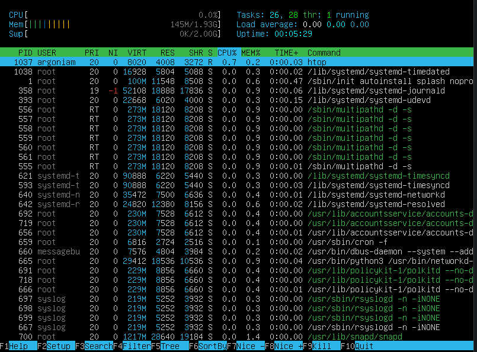 |
| :--------------------------------------------------------------------------------------: |
|                       _Рис. 47. Вывод команды htop без сортировки_                       |

Вывод команды отсортированной по PID, для этого можно использовать команду `htop --sort-key X`, где X - это параметр по которому будет происходить сортировка, либо на неотсортированном `htop` нажать `F6` и выбрать параметр сортировки (`PID`).

| 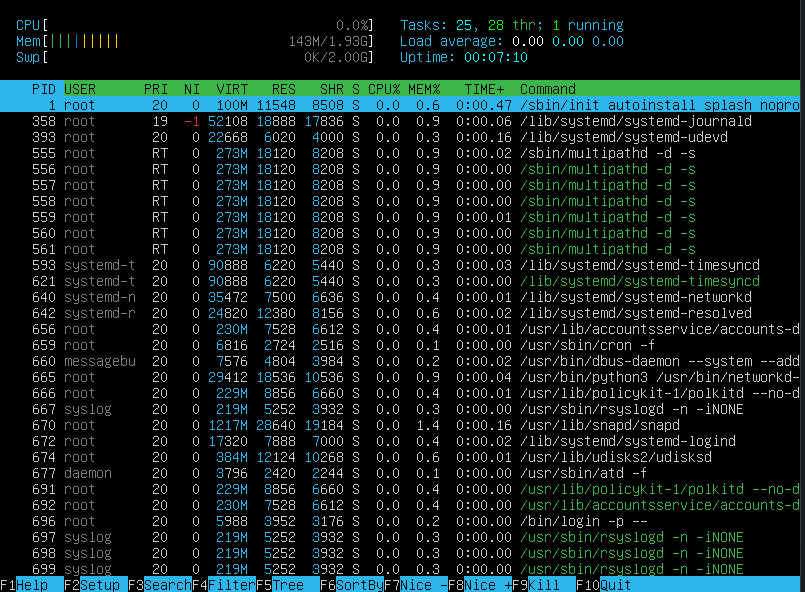 |
| :-------------------------------------------------------------------------------------------------------: |
|                           _Рис. 48. Вывод команды htop отсортированный по PID_                            |

Вывод `htop` отсортированный по `PERCENT_CPU`:

| 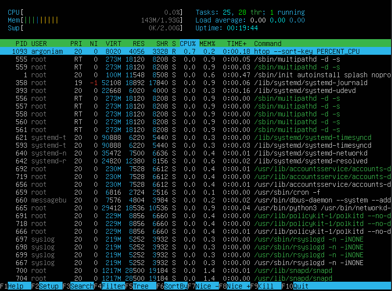 |
| :-------------------------------------------------------------------------------------------------------------------------------: |
|                                   _Рис. 49. Вывод команды htop отсортированный по PERCENT_CPU_                                    |

Вывод `htop` отсортированный по `PERCENT_MEM`:

| 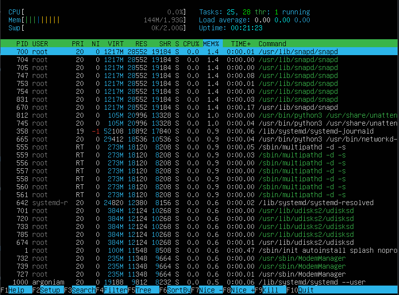 |
| :-------------------------------------------------------------------------------------------------------------------------------: |
|                                   _Рис. 50. Вывод команды htop отсортированный по PERCENT_MEM_                                    |

Вывод `htop` отсортированный по `TIME`:

| 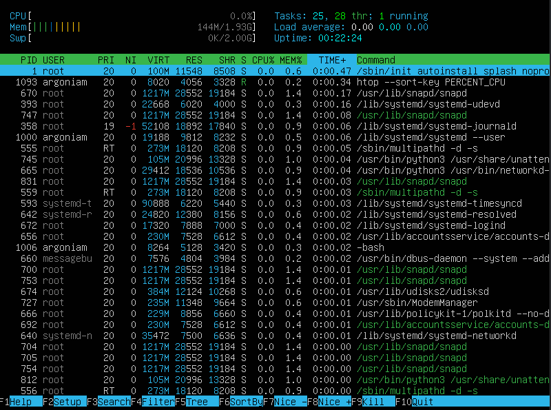 |
| :----------------------------------------------------------------------------------------------------------: |
|                            _Рис. 51. Вывод команды htop отсортированный по TIME_                             |

Для того чтобы отфильтровать `htop` для процесса `sshd` нужно нажать `F4` и написать нужный фильтр (`sshd`).

| 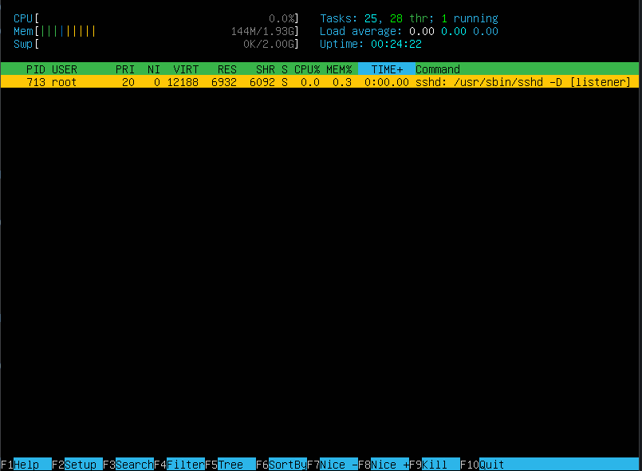 |
| :-------------------------------------------------------------------------------------------------------------: |
|                              _Рис. 52. Вывод команды htop отфильтрованный по sshd_                              |

Для поиска в `htop` нужно нажать `F3` и написать объект поиска, по найденным процессам можно перемещаться с помощью кнопки `F3` (next).

| 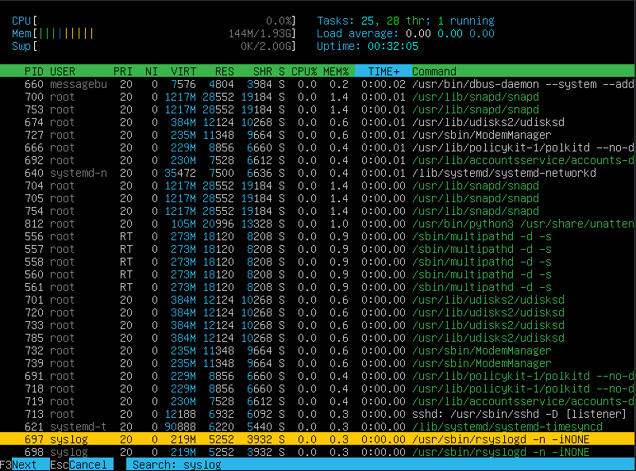 |
| :--------------------------------------------------------------------------------------------------------------------: |
|                                     _Рис. 53. Вывод команды htop с поиском syslog_                                     |

Для добавления отображения дополнительных параметров в `htop`, нужно нажать `F2` выбрать нужный параметр (`hostname`, `clock`, `uptime`) и переместить в нужный нам столбец в котором будет отображаться этот параметр.

| 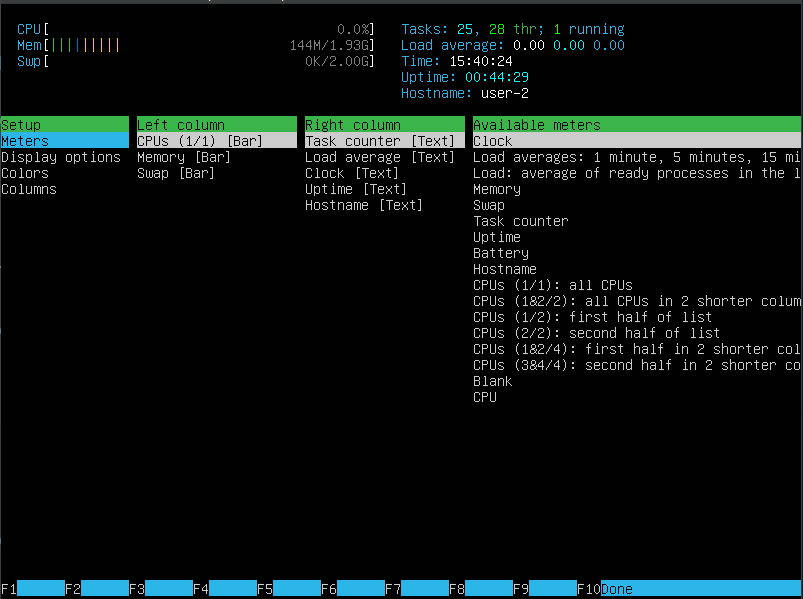 |
| :----------------------------------------------------------------------------------: |
|                _Рис. 54. Вывод сетап панели управления команды htop_                 |

|  |
| :------------------------------------------------------------------------------------------------------------------------------------: |
|                                   _Рис. 55. Вывод команды htop с выводом дополнительных параметров_                                    |

## Part 10. Использование утилиты fdisk

Выполним команду: `sudo fdisk -l`

| 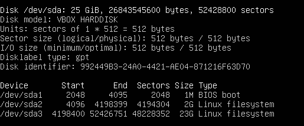 |
| :--------------------------------------------------: |
|            _Рис. 56. Вывод команды fdisk_            |

- Название жесткого диска: `VBOX HARDDISK`
- Размер диска: `26 GiB`
- Количество секторов: 52428800 по 512 bytes

Чтобы узнать размер `swap` выполним команду: `free -m`

| 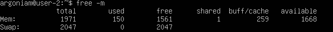 |
| :---------------------------------------------------------: |
|           _Рис. 57. Вывод команды параметра swap_           |

## Part 11. Использование утилиты df

Выполним команду `df`:

| 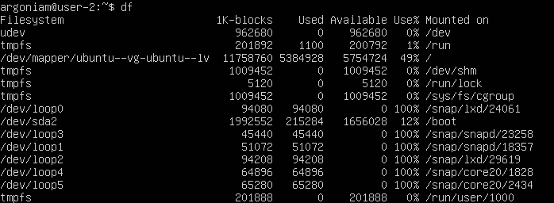 |
| :-------------------------------------------------: |
|             _Рис. 58. Вывод команды df_             |

- Размер раздела: `11758760`
- Размер занятого пространства: `5384928`
- Размер свободного пространства: `5754724`
- Процент использования: `49%`
- Единицы измерения при выводе: `Килобайты`

---

Выполним команду `df -Th`

| 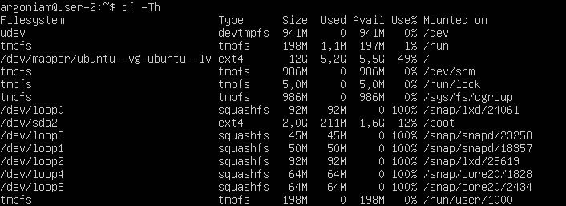 |
| :--------------------------------------------------------------------------: |
|                 _Рис. 59. Вывод команды df с параметрами Th_                 |

- Размер раздела: `12`
- Размер занятого пространства: `5,2`
- Размер свободного пространства: `5,5`
- Процент использования: `49%`
- Единицы измерения при выводе: `Гигабайты`
- Тип файловой системы: `ext4`

## Part 12. Использование утилиты du

Выполним команду: `du`

| 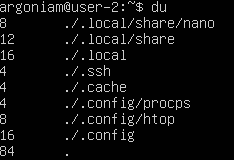 |
| :-------------------------------------------------: |
|             _Рис. 60. Вывод команды du_             |

---

Вывод размера папки `/home`: `sudo du -bs /home`

| 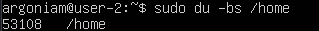 |
| :------------------------------------------------------------------------------------------------------: |
|                              _Рис. 61. Вывод команды du для /home в байтах_                              |

Вывод размера папки `/home`: `sudo du -hs /home`

| 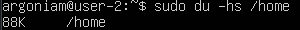 |
| :---------------------------------------------------------------------------------------------------------------------: |
|                              _Рис. 62. Вывод команды du для /home в человекочитаемом виде_                              |

Вывод размера папки `/var`: `sudo du -bs /var`

| 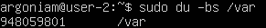 |
| :---------------------------------------------------------------------------------------------------: |
|                             _Рис. 63. Вывод команды du для /var в байтах_                             |

Вывод размера папки `/var`: `sudo du -hs /var`

| 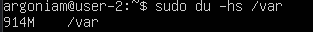 |
| :------------------------------------------------------------------------------------------------------------------: |
|                             _Рис. 64. Вывод команды du для /var в человекочитаемом виде_                             |

Вывод размера папки `/var/log`: `sudo du -bs /var/log`

| 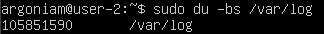 |
| :--------------------------------------------------------------------------------------------------------------: |
|                                _Рис. 65. Вывод команды du для /var/log в байтах_                                 |

Вывод размера папки `/var/log`: `sudo du -hs /var/log`

| 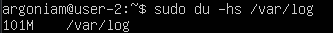 |
| :-----------------------------------------------------------------------------------------------------------------------------: |
|                                _Рис. 66. Вывод команды du для /var/log в человекочитаемом виде_                                 |

---

Вывод размера всего содержимого папки `/var/log`: `sudo du -hs /var/log/*`

| 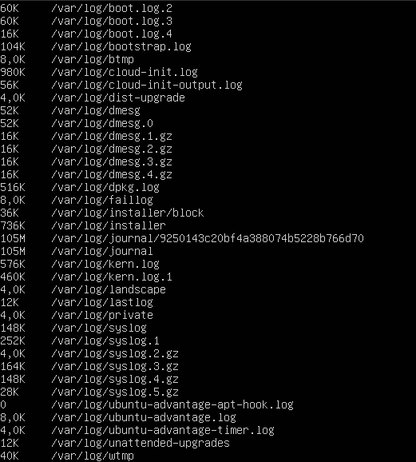 |
| :------------------------------------------------------------------------------------------------------------------------------------------: |
|                          _Рис. 67. Вывод команды du для всех файлов директории /var/log/\* в человекочитаемом виде_                          |

## Part 13. Установка и использование утилиты ncdu

Введем команду для установки ncdu: `sudo apt-get install ncdu`

---

Выведем размер папки `/home`:

| 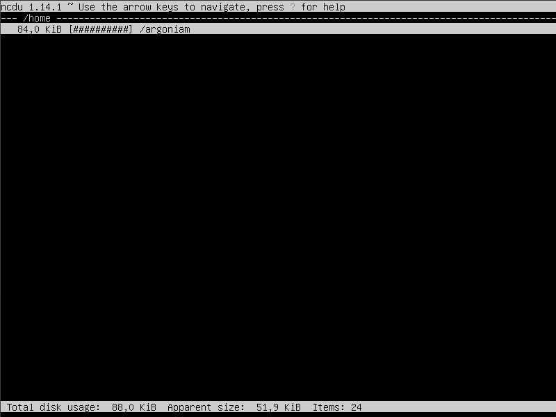 |
| :---------------------------------------------------------------------------------------: |
|                    _Рис. 68. Вывод команды ncdu для директории /home_                     |

Выведем размер папки `/var`:

| 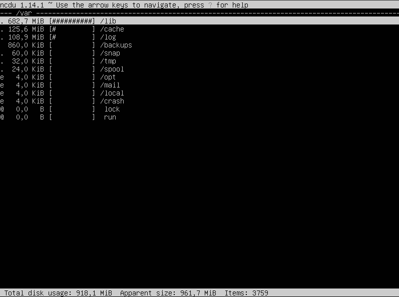 |
| :------------------------------------------------------------------------------------: |
|                   _Рис. 69. Вывод команды ncdu для директории /var_                    |

Выведем размер папки `/var/log`:

| 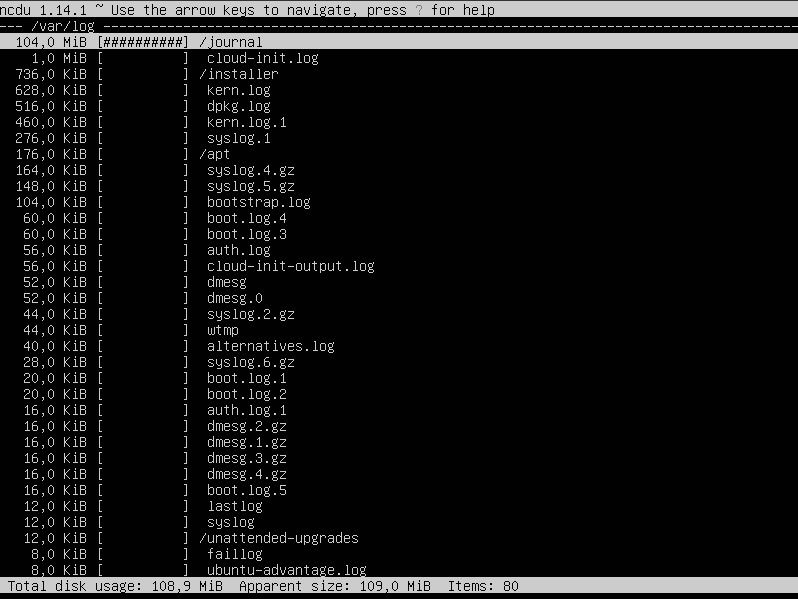 |
| :-----------------------------------------------------------------------------------------------: |
|                       _Рис. 70. Вывод команды ncdu для директории /var/log_                       |

## Part 14. Работа с системными журналами

Чтобы открыть для просмотра `/var/log/dmesg`, используем команду: `cat /var/log/dmesg | less`

| 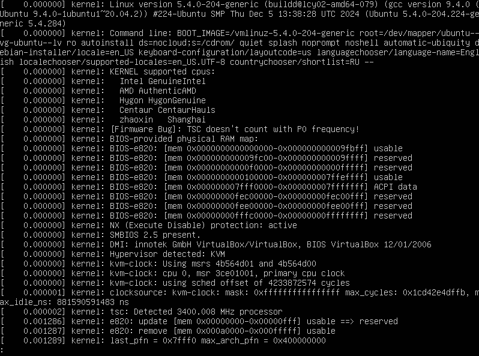 |
| :--------------------------------------------------------: |
|                _Рис. 71. Вывод файла dmesg_                |

Чтобы открыть для просмотра `/var/log/syslog`, используем команду: `cat /var/log/syslog | less`

| 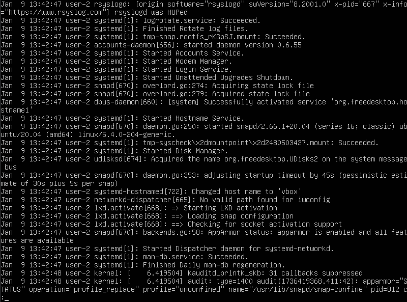 |
| :-----------------------------------------------------------: |
|                 _Рис. 72. Вывод файла syslog_                 |

Чтобы открыть для просмотра `/var/log/auth.log`, используем команду: `cat /var/log/auth.log | less`

|  |
| :----------------------------------------------------------------: |
|                  _Рис. 73. Вывод файла auth.log_                   |

- Время последней успешной авторизации: Jan 9, 13:43:21
- Имя пользователя: argoniam
- Метод входа в систему: by uid = 0 (User Identifier). Суперпользователь всегда должен иметь UID, равный нулю (0).

|  |
| :----------------------------------------------------------------: |
|                  _Рис. 74. Вывод файла auth.log_                   |

- Перезапустим службу SSHd с помощью команды: `sudo systemctl restart ssh`
- В журнале найдем сообщение о перезапуске службы:

| 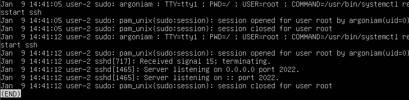 |
| :------------------------------------------------------------------------------------------------: |
|                         _Рис. 75. Вывод файла auth.log о перезапуске ssh_                          |

## Part 15. Использование планировщика заданий CRON

Чтобы открыть планировщик заданий CRON используем команду `crontab -e`

Для того чтобы сделать запуск команды `uptime` раз в 2 минуты нужно добавить команду `*/2 * * * * uptime` в открывшемся текстовом редакторе nano:

| 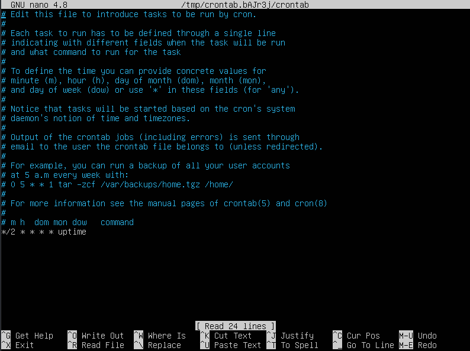 |
| :------------------------------------------------------------------------: |
|                              _Рис. 76. CRON_                               |

Чтобы найти в системных журналах строчке о выполнении `uptime`, используем команду `cat var/log/syslog | less`

| 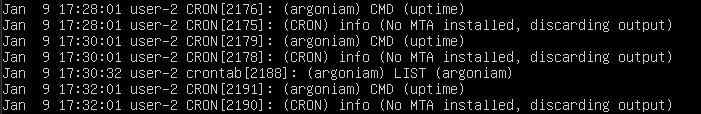 |
| :-----------------------------------------------------------------------------------------------------: |
|                                      _Рис. 77. Выполнение uptime_                                       |

Для вывода текущего списка заданий CRON, используем команду: `crontab -l`

| 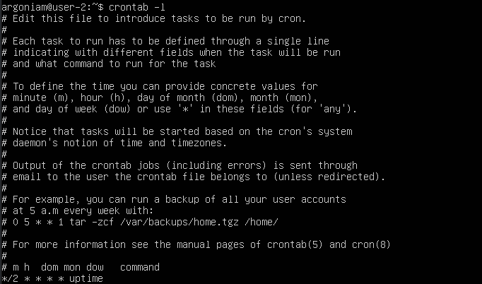 |
| :-------------------------------------------------------------------------------------: |
|                           _Рис. 78. список всех заданий CRON_                           |

---

Чтобы удалить все задачи в планировщике заданий `CRON`, используем команду `crontab -r` и чтобы проверить, что все задания удалены, используем `crontab -l`:

|  |
| :--------------------------------------------------------------------------------------------------------------------: |
|                                          _Рис. 79. список всех заданий CRON_                                           |
